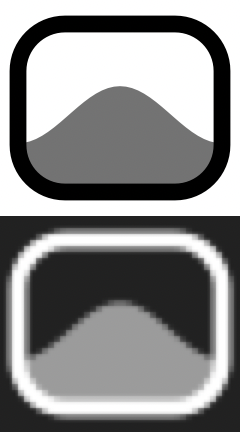

# LiveWall

A live wallpaper app for macOS built around one constraint: **it should cost
almost nothing when you aren't looking at it.**

Existing video wallpaper apps mostly wrap `AVPlayer` around whatever file you
drop in and leave it decoding whether or not the desktop is visible. That is why
they show up in Activity Monitor and why laptop fans spin. LiveWall takes the
opposite approach — every design decision below trades features for resources.

Status bar only. No dock icon, no window, no dependencies — the menu bar item is
the entire interface:



## Samples

Two loops to try it with, in [`Samples/`](Samples/). Generated from the app's own
procedural field rather than sourced, so they are original work under this
repository's licence — and they loop seamlessly, measured at **0.991** SSIM
across the seam.

|  |  |
|---|---|
| `Samples/aurora.mp4` | `Samples/ember.mp4` |

Regenerate or retune with [`tools/make-samples.sh`](tools/make-samples.sh).

## Measured

Real numbers from this machine (M3 Pro, 3024×1964 Retina panel at 120 Hz), using
`footprint(1)` for memory — the same figure Activity Monitor shows — and `top`'s
one-second interval for CPU. Reproduce with `./tools/measure.sh`.

| State | Memory | CPU |
|---|---|---|
| Procedural gradient mode | **12 MB** | **0.0%** |
| Video, 3492×1964 10-bit 24 fps HEVC, desktop visible | **19 MB** | **2.9%** |
| Video, desktop covered | **12 MB** | **0.0%** |

CPU is a percentage of one core; on a 12-core M3 Pro, 2.9% of a core is roughly
0.25% of the machine. Binary: **504 KB** (the 1.6 MB bundle is mostly the icon).

### What the resolution and bitrate actually cost

Measured against the real playback path, same clip, one variable at a time:

| Variant | Pixels | Memory | CPU |
|---|---|---|---|
| 1280×720, 1.4 Mbps, 8-bit | 1.0× | 15 MB | 3.00% |
| 1920×1080, 3.1 Mbps, 8-bit | 2.3× | 16 MB | 3.14% |
| 1920×1080, 6.8 Mbps, 8-bit | 2.3× | 18 MB | 2.74% |
| 3492×1964, 10 Mbps, 8-bit | 7.4× | 18 MB | 3.44% |
| 1920×1080, 5.6 Mbps, 10-bit | 2.3× | 18 MB | 2.92% |
| 1920×1080, 6.8 Mbps, **60 fps** | 2.3× | 19 MB | **7.78%** |

**Pixels are free, bits are free, frames are expensive.** HEVC decode is
fixed-function on the media engine and flat in frame size; what remains is the
app's own per-frame pump work, which scales with frames per second and nothing
else. So the presets spend freely on resolution, bit depth and bitrate, and stay
frugal with frame rate.

## How it stays cheap

**Occlusion tears down, it does not pause.** When nothing on a display can see
the wallpaper, the `AVAssetReader` and its decompression session are *destroyed*,
not suspended. The last frame stays composited by WindowServer at no cost, and
playback resumes from the saved timestamp when the desktop reappears. Teardown
is delayed 0.4 s so window animations and Mission Control don't thrash it;
re-activation is immediate.

**Partial coverage counts too.** `NSWindow.occlusionState` is a yes/no: a window
covering all but a corner of the desktop still reports the wallpaper as visible,
and the old code decoded at full rate for that corner. LiveWall derives the
uncovered fraction from the window list and stops below 8%, resuming above 15%.
Only ordinary application windows count — the menu bar and Dock are not things
users think of as covering their desktop.

**One frame in flight.** A display link pulls exactly one sample buffer per tick
and enqueues it marked `DisplayImmediately`. There is no control timebase and no
read-ahead queue, so the decoder's pixel buffer pool sits at its floor instead of
the ~30 frames `AVPlayer` would buffer.

The obvious alternative was built and measured: driving the pump from
`requestMediaDataWhenReady` with an `AVSampleBufferRenderSynchronizer` timebase
removes the display link, the main-thread wake per frame and both dispatch hops —
and cost **28 MB against 19 MB for no CPU improvement**. The renderer reads ahead
by an amount you can't control, and at these resolutions one 10-bit frame is
~20 MB.

**Never name a pixel format.** Asking the reader for a specific format made
AVFoundation revalidate every decoded buffer against it —
`CMVideoFormatDescriptionMatchesImageBuffer` → `copyIOSurfaceAttachment` →
`IOConnectCallMethod` → `mach_msg2_trap`, a synchronous kernel round trip per
frame, plus live converter threads. Requesting nothing takes
`copyNextSampleBuffer` from **65 profiler samples to 4**. Hardware HEVC decode
already hands back IOSurface-backed 4:2:0 at the file's own bit depth.

**The procedural mode uses no Metal at all.** It is a `CAGradientLayer` with
keyframes handed to the render server once — the compositor interpolates on the
GPU and the app's own CPU cost is literally zero. A Metal shader version exists
and is used automatically if a precompiled `wallpaper.metallib` is bundled, but
compiling that shader *at runtime* was measured at **~97 MB** of resident
graphics memory that is never released.

**Nothing is painted opaque.** The desktop window sits above the system wallpaper,
so anything it draws hides it. Every layer is transparent, which means "no
wallpaper of ours" degrades to the system's own picture rather than to a black
rectangle — and letterbox bars in Fit mode show your real wallpaper.

## When rendering stops

| Signal | Behaviour |
|---|---|
| Desktop fully occluded | teardown after 0.4 s |
| Under 8% of the desktop uncovered | teardown; resumes above 15% |
| Screen locked, display asleep, screensaver | teardown |
| Thermal state `.serious` or `.critical` | teardown |
| Low Power Mode | teardown |
| Battery below 20% | teardown |
| On battery at all | optional, off by default |
| No input for 15 minutes | teardown |

Every one of these is a hard stop rather than a slowdown, and that is forced by
the decode path: playback pulls one frame per tick and the assets have no
B-frames, so every frame is a reference frame that must be decoded whether or not
it is shown. Lowering the tick rate would play the clip in slow motion, not more
cheaply. Stopping is both free and graceful — the last frame stays on screen.

## Import is mandatory

Videos are converted on import and only the converted file is ever played. This
is the trade that makes the runtime numbers predictable: the playback path never
sees an unknown codec.

| Source problem | Cost if played directly | Fixed at import |
|---|---|---|
| VP9 / AV1 / ProRes | software decode, tens of % CPU | transcoded to HEVC → media engine |
| Source larger than the panel | decodes pixels you can't see | scaled to cover the display, never past 1:1 |
| 60 fps | 2.5× the pump work | capped, and snapped to a divisor of the refresh rate |
| Audio track | AVFoundation spins an audio graph | stripped |
| B-frames | decoder needs a reorder buffer | frame reordering disabled |
| `moov` atom at EOF | full-file read before playback | `shouldOptimizeForNetworkUse` |

Frame rate is snapped down to a rate that divides the display's refresh exactly:
24 fps divides 120 Hz evenly, but on a 60 Hz panel it doesn't, and a frame
arriving between two refreshes is decoded and then dropped by the compositor.

Presets:

| Preset | Size | Rate | Depth |
|---|---|---|---|
| Ultra Light | 960p | 20 fps | 8-bit |
| Balanced | 1920p | 24 fps | 8-bit |
| Native (default for new imports) | your display | 24 fps | 10-bit |

Conversion uses `AVAssetWriter` + VideoToolbox — no bundled `ffmpeg`, which would
add 40–70 MB and a licensing question to a 504 KB app. Your original file is
never copied or modified.

## Scaling

Fill (default), Fit or Stretch, switchable from the menu. It is a property of the
presentation layer, so switching is free — no re-encode, no reload, nothing on
disk changes. Each mode's menu tooltip states what it costs for the wallpaper and
display you actually have, e.g. *"Crops 13% of the width."*

## Install

```sh
./tools/install.sh              # builds, installs to /Applications, launches
PREFIX=~/Applications ./tools/install.sh
```

Then use **Add Video…** in the status bar menu.

**Install it before enabling Open at Login.** `SMAppService` reports `.notFound`
for an app running out of a build directory — LaunchServices does not consider it
an installed application, so `register()` has nothing to bind to. The toggle
looks like it worked, nothing is recorded, and you find out after a restart. The
menu warns when the app is running from somewhere this applies.

## Build without installing

```sh
./tools/bundle.sh release
open build/LiveWall.app
```

```sh
swift test                      # 31 tests, no device or display needed
./tools/measure.sh 20           # sample memory and CPU of the running app
swift tools/make-icon.swift     # regenerate Resources/AppIcon.icns
./tools/make-samples.sh         # regenerate Samples/ and their poster frames

# verbose logging to stderr — logs every gate transition
LIVEWALL_VERBOSE=1 build/LiveWall.app/Contents/MacOS/LiveWall

# render even when the desktop is covered, so cost can be measured on a
# machine whose desktop is behind a terminal
LIVEWALL_FORCE_RENDER=1 build/LiveWall.app/Contents/MacOS/LiveWall

# convert without the UI
build/LiveWall.app/Contents/MacOS/LiveWall --convert in.mp4 out.mov native
```

### Distribution

Ad-hoc signing is the default and works only on the machine that built it.
Gatekeeper needs a Developer ID, the hardened runtime and notarization:

```sh
SIGN_IDENTITY="Developer ID Application: You (TEAMID)" ./tools/bundle.sh release

# once, to store notarisation credentials
xcrun notarytool store-credentials livewall \
    --apple-id you@example.com --team-id TEAMID --password app-specific-password

SIGN_IDENTITY="Developer ID Application: You (TEAMID)" \
NOTARY_PROFILE=livewall ./tools/bundle.sh release
```

A stable signature also matters for **Open at Login**: `SMAppService`
registrations are keyed to the bundle identity, so an ad-hoc build re-registers
on every rebuild.

## Layout

```
Sources/LiveWall/
  App/        AppDelegate (status menu), WallpaperEngine, ScreenController
  Render/     DesktopWindow, VideoSource, GradientSource, ShaderSource,
              MetalRuntime, FitMode
  Import/     Transcoder, FramePacer, Library
  Support/    PowerMonitor, DesktopVisibility, LoginItem, Footprint, Log
Tests/LiveWallTests/
              coverage geometry, frame pacing, output sizing, index decoding
```

The desktop window sits at `kCGDesktopWindowLevel`, below
`kCGDesktopIconWindowLevel`, so icons draw on top and it never takes clicks or
joins window cycling. One window per `NSScreen`, each with independent occlusion
state.

## Known limits

- **Each display decodes independently.** A two-monitor setup runs two decoders.
  Sharing one would be cheaper only while both are visible; separate sources let
  a covered display tear down on its own. Worth revisiting for 3+ displays.
- **Multi-display is untested.** All of the above is written for it and none of
  it has been exercised on a second screen.
- **Teardown saves more CPU than memory.** The decoder's pool is small; stopping
  decode is the point, and the memory number was already low.
- **The Metal shader mode needs the Metal toolchain**
  (`xcodebuild -downloadComponent MetalToolchain`). Without it `bundle.sh` skips
  the metallib and the app uses the cheaper gradient. This is not a real loss.
- **Not sandboxed.** Reading a user-chosen video and writing to Application
  Support would both need entitlements; nothing here requires the sandbox yet.
- **One wallpaper on all displays.** No per-display assignment, no playlist.
- **The thermal, low-battery and idle gates are coded but not observed firing** —
  the conditions are awkward to stage deliberately.
- **Survival across an actual restart is unverified.** The login item reports
  `enabled` from an installed copy, which is the strongest signal available
  short of rebooting.
- **A stale entry may linger in Login Items** for any copy registered from a
  build directory before installing. Remove it in System Settings › General ›
  Login Items.
